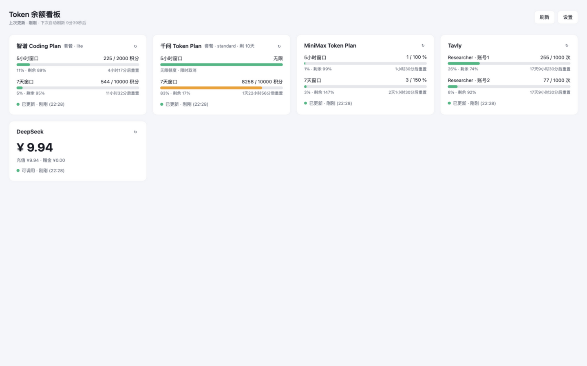

# Token 余额看板

本地自用的 AI 服务额度聚合看板：把 DeepSeek、智谱、Tavly、千问、MiniMax、SiliconFlow、Kimi 七家的余额/用量收进一个页面，定时自动刷新，额度不足时红条 + macOS 桌面通知告警。

纯本地运行（Flask + Alpine.js，无构建步骤），所有 Key 存在自己机器的 `data/config.json`，不经过任何第三方服务器。



    

## 功能

- **7 家服务聚合**：余额型（DeepSeek、SiliconFlow）、窗口型（智谱/千问/MiniMax/Kimi 积分或百分比或次数）、多账号次数型（Tavly 支持双账号）
- **自动刷新**：后台每 10 分钟并发拉取；卡片可单独刷新；带防风控冷却
- **额度告警**：余额/百分比阈值触发顶部红条 + macOS 桌面通知（带去重防抖）
- **失败保护**：偶发拉取失败时保留上次成功数据，不闪断
- **主题**：亮 / 暗 / 跟随系统
- **卡片拖拽排序**、**provider 开关**（关闭的不刷新不展示）
- **主密码**：复制已存 Key 需验证（PBKDF2-SHA256 哈希存储，不存明文）

详细版本变更见 [CHANGELOG.md](CHANGELOG.md)。

## 快速开始（macOS）

双击 `启动.command` 即可：自动创建虚拟环境、装依赖、清残留端口进程、打开浏览器访问 `http://localhost:5070`。

命令行方式：

```bash
python3 -m venv .venv
source .venv/bin/activate
pip install -r requirements.txt
python app.py          # 打开 http://localhost:5070
```

端口在 `config.py` 的 `PORT` 改（默认 5070；不能用 5060，Chrome/Edge 视其为受限端口）。

打开后点右上「设置」，逐家填 Key（见下表），填完自动触发一次刷新。

## 各服务配置指引

| 服务 | 需要填什么 | 哪里获取 |
|---|---|---|
| DeepSeek | API Key（`sk-…`） | [开放平台](https://platform.deepseek.com) → API Keys |
| 智谱 Coding Plan | API Key（`xxx.yyy` 格式，不加 Bearer） | [开放平台](https://open.bigmodel.cn) → API Keys |
| Tavly | API Key（`tvly-…`），支持两个账号（逗号分隔） | [控制台](https://app.tavily.com) → API Keys |
| MiniMax Token Plan | Subscription Key（**必须 `sk-cp-` 开头**，普通 API Key 会 401） | [平台](https://platform.minimaxi.com) → API Keys |
| SiliconFlow | API Key（`sk-…`） | [开放平台](https://cloud.siliconflow.cn) → API 密钥 |
| Kimi For Coding | Kimi API Key（`sk-…`） | [开放平台](https://platform.kimi.com) → API Key（For Coding 套餐的 key） |
| 千问 Token Plan | `sec_token` + `cookie`（F12 抓取，见下） | 见下方步骤 |

### 千问 Token Plan 抓取步骤

千问平台**不提供 API Key 查询额度的接口**，看板通过请求其控制台网页所用的内部接口获取数据，因此需要从浏览器复刻登录态（与 [token-ball](https://github.com/yedsn/token-ball) 等同类项目方案一致）：

1. Edge/Chrome 登录 [platform.qianwenai.com](https://platform.qianwenai.com)，进入 Token Plan 订阅页
2. `F12` → Network 面板 → 过滤框输入 `usage` → 刷新页面
3. 找到 `usage` 请求：
   - **Payload** 里复制 `sec_token` 的值
   - **Headers** → Request Headers → 复制整行 `cookie`
4. 看板设置页分别填入 `qianwen_sec_token` 和 `qianwen_cookie` 两个框

登录态有效期约几天到两周，失效时卡片会提示「登录态失效，请重新抓取」，重复上述步骤即可。

### 网络说明（国内用户）

- **Tavly**：`api.tavly.com` 国内直连不通。看板会自动走 DoH 解析真实 IP + 探测本地 Clash 代理端口重试，无需手动配置；两者都不可用时才会失败。
- **MiniMax**：`api.minimaxi.com` 国内直连不稳定，建议开系统代理。

## 配置与数据

全部存在本地 `data/` 目录（已 gitignore，不会误提交）：

- `data/config.json` — API Keys、主题、卡片顺序、开关、告警阈值、主密码哈希
- `data/cache.json` — 最近一次拉取结果缓存（启动时秒开，不等网络）

## 测试

```bash
source .venv/bin/activate
python -m pytest -v      # 75 项用例
```

## 免责声明

本项目仅供个人查询自己账户的额度信息使用。千问等无公开 API 的服务通过模拟控制台请求获取数据，请自行评估相关平台服务条款；所有凭据仅保存在本地。

## License

[MIT](LICENSE)
